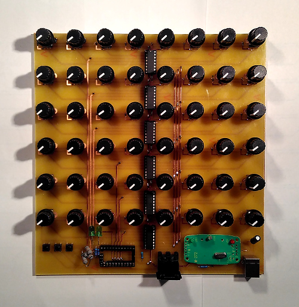

# 48Knobs
PCB schematics and firmware for a custom MIDI controller

## About

DIY Arduino MIDI controller featuring 48 rotatory knobs (potentiometers). The values are sent out by MIDI CC signals through DIN-5 or USB port. Intended use is to control various software synthesizers but it can be used as a virtual mixer control or user input for custom software (for example [MAX/MSP](https://cycling74.com/products/max/) or [Processing](https://processing.org/) applications).
My work on this project started before Bastl Instruments released their own [60Knobs](http://www.bastl-instruments.com/instruments/sixtyknobs/) controller but I included some of their ideas to my controller (). 

### Features

- 48 knobs!
- USB MIDI output
- *USB powered* = doesn't need a separate power supply
- 3 buttons (1 for sending out all the values, 2 for switching the MIDI mapping)
- 2 signal LEDs
- MIDI OUT DIN output

## Schematics and PCB layout

Knobs are divided into six rows of eight potentiometers each. In each row, potentiometers are connected to a 8-channel multiplexer, the output is connected directly to analog pins on the Arduino Mini (there are 8 analog pins in total out of which 6 are used). Three digital pins are connected to selector pins on MUX'es.
For MIDI output, TX pin is connected to DIN-5 connector and _MIDI to USB_ adapter, I didn't bother creating my own schematic for _MIDI to USB_ since it was so cheap on eBay. 
MIDI input is not implemented, although it would have been nice for configuration without reprogramming.

### Parts

- 1x [DIN 5 connector (MIDI)](https://www.gme.cz/konektor-din-5-p-zp90-st)
- 1x [USB B connector](https://www.gme.cz/konektor-usb1x90b-pcb)
- 3x Microbutton
- 2x LED
- 3x 10k ohm resistor
- 4x 220R resistors
- 6x 100n capacitor
- 1x 100u capacitor
- 1x [MIDI to USB adapter](https://www.ebay.com/itm/MIDI-to-USB-Interface-Cable-Adapter-for-Keyboard-Electronic-Drum-Music-Create-/252468442079)
- 48x [vertical 100k potentiometer](https://www.aliexpress.com/item/Free-shipping-RV09-type-vertical-adjustable-potentiometer-variable-resistor-1K-2K-5k-10K-20K-50K-100K/1871188517.html)
- 6x [74HC4051 Multiplexer](https://www.aliexpress.com/item/10pcs-free-shipping-74HC4051N-74HC4051-SN74HC4051N-DIP-16-Multiplexer-Switch-ICs-8-CHANNEL-ANALOG-MUX-DEMUX/32416713940.html)
- 1x [ATMEGA328P Mini board](https://www.aliexpress.com/item/5pcs-lot-Pro-Mini-328-Mini-ATMEGA328-5V-16MHz-Free-Shipping-Dropshipping/1626715214.html)
- 48x [potentiometer knob caps](https://www.aliexpress.com/item/Newest-Hot-Sale-10-Pcs-6mm-Shaft-Hole-Dia-Plastic-Threaded-Knurled-Potentiometer-Knobs-Caps/32622012364.html)

### Possible improvements

- Potentiometers didn't fit well - the distance between 2mm holes should be a bit smaller (~0.2mm).
- LEDs and 100k resistors are too close.
- DIN-5 connector needs bigger holes (~1.2mm instead of 0.8mm)
- The design allows for adding more rows, it is possible to add 16 more knobs without much hassle (there are two free analog ports left on the Arduino). Adding more rows should be possible using another multiplexer.
- MIDI to USB should be easy enough to include on the main board. It was just easier for me to buy it.

## Firmware

The software scans through all the potentiometers, averages the values and sends out only the changes using [MIDI library](https://github.com/FortySevenEffects/arduino_midi_library). Optionally there is a raw output mode implemented for debugging.